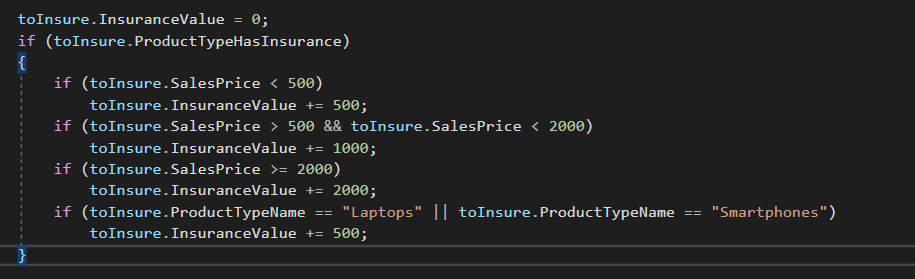
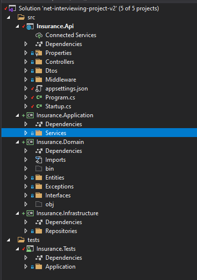
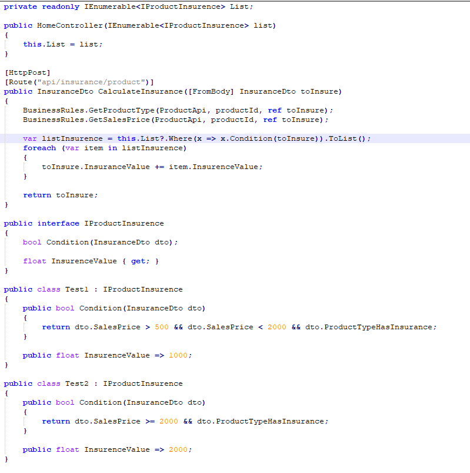

## Github Reposiory:

https://github.com/ericksavassa/insurance-api

 

# TASK 1:

 

* Fixed the rule to add insurance cost on product with sale value less than 500 and changed the IF to avoid check *toInsure.ProductTypeHasInsurance* all the time

* Changed the URL on *ControllerTestFixture* because ProductApi was using same port (5002), this way the "integrated" tests could run
* Add "integrated" test for the new implementation

For this task I only fixed the bug and kept the structure of the project and tests because in the Task 2 I will refactor the entire solution, splitting the layers, creating unit tests, etc.

 

# TASK 2:

 

* I decided to split the solution code into some new layers, trying to following something similar to Clean Architecture, I think it is a good approach that keep business in just one place 
and it is easy to implement some S.O.L.I.D principles and it is clean to understand

* I took other decisions to change some names (eg. HomeController to ProductController) to be easy to find some objects or business rules
* I used Serilog to log some data but for now I only used Console and File sinks, and used exception middleware to handle the errors of the application
* I created unit tests for the business rules and integatred tests I kept into Postman collection file (postman-collection folder on root)

* In this task I thought about use some strategy to check the conditions of the insurance value, but as it is a simple API i decided to keep the if condition, if the API evolves we can implement something like a strategy per type of condition. Something like this:

# TASK 3:

 

* New endpoint implemented, calling the method that was already implemented to calculate insurance for each product

# TASK 4:

 

* New rule implemented, changing the method that was already implemented to return product instead of just insurance value

# TASK 5:

 

* New rule implemented, changing the method that was already implemented to return product instead of just insurance value

