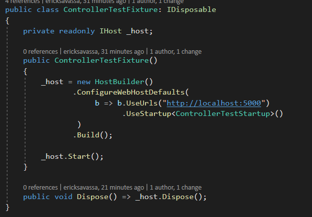
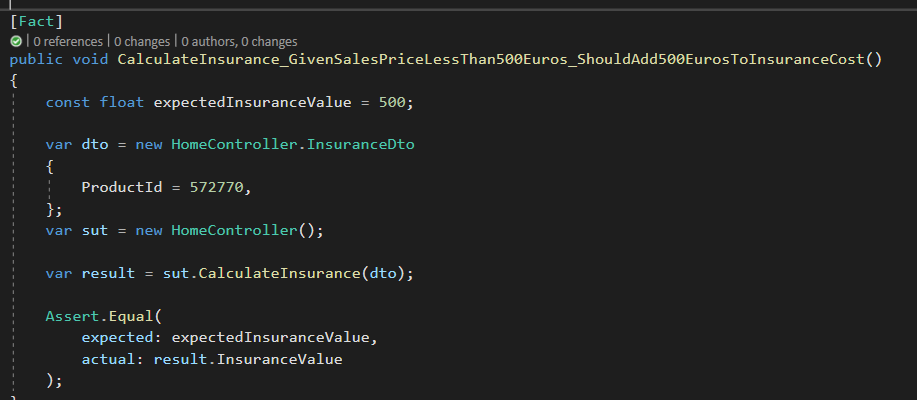

## Github Reposiory:

https://github.com/ericksavassa/insurence-api

 

## TASK 1:

### Assumption/Decision Made:
 

* Fixed the rule to add insurence cost on product with sale value less than 500 and changed the IF to avoid check *toInsure.ProductTypeHasInsurance* all the time

* Changed the URL on *ControllerTestFixture* because ProductApi was using same port (5002), this way the "integrated" tests could run

* Add "integrated" test for the new implementation

### Reasons:

I only fixed the bug and kept the structure of the project and tests because in the Task 2 I will refactor the entire solution, splitting the layers, creating unit tests, etc.

